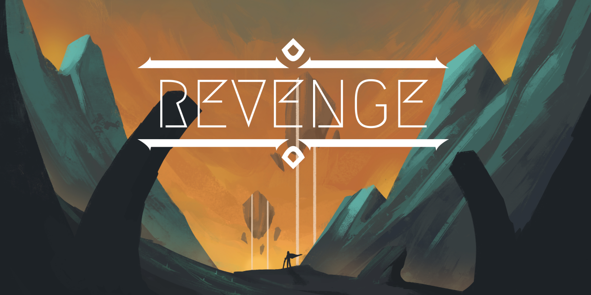

# REVENGE
  
3D Adventure platformer game  
[Dibuat dengan Unity 2018.4.3 (LTS)](https://unity3d.com/unity/qa/lts-releases?version=2018.4)

## Our Team
Role | Members
-|-
Project Manager | ALIYA JAUHARI HILDAYANTI
Game Producer | SUWANDI AMIN SANGAJI
Game Designer | ULIN NUHA TRISIANA   
 
<i>2nd role supporters:</i>
 ARDIAN NUR P.   NURDIN LABIKA 

Programmer | ANDIKA WIRAPALA FATHIN AZFAR   ALIFIAN PUTRA SUGIHARTO   
 
<i>2nd role supporters:</i>
 ADLI RA’I RAFIF   ULIN NUHA TRISIANA 

3D Artist | M. THIRAFI H. S   ADLI RA’I RAFIF     
 
<i>2nd role supporter:</i>
 ADLI RA’I RAFIF   ULIN NUHA TRISIANA   ANDIKA WIRAPALA FATHIN AZFAR 

2D Artist | MUHAMMAD FAJRI
Game Tester | ARDIAN NUR P.   NURDIN LABIKA

## How to Contribute
- **Fork** repositori ini
- **Clone** repo hasil fork ke penyimpanan lokal.
- **Commit** perubahan
- **Push** perubahan ke repo
- Submit **Pull Request**
    - Base Dropdown: deutandev/revenge
    - Compare Dropdown: Repo hasil fork

### Resources
[Download Github Desktop](https://desktop.github.com/)  
[Pull request tutorial](https://github.com/yangsu/pull-request-tutorial)  
[Git command cheat sheet](https://training.github.com/downloads/id/github-git-cheat-sheet/)
